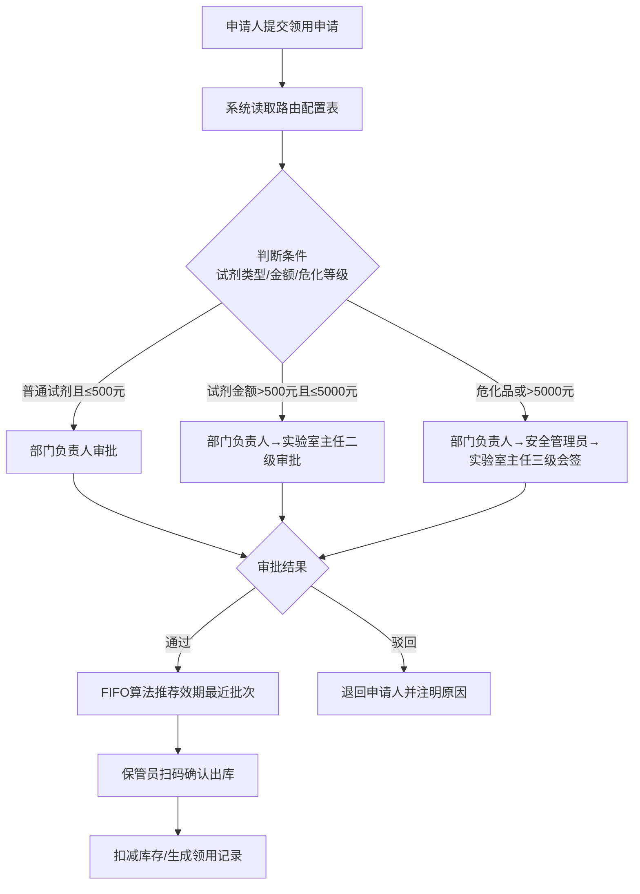

## 1. 产品概述

实验室试剂出入库智能管理系统，针对检测实验室的试剂全生命周期管理需求，解决试剂批次混乱、效期失控、审批流程僵化等痛点。系统通过先进先出算法确保效期合规，动态路由审批实现灵活流程配置，全方位提升实验室试剂管理的安全性、合规性与效率。

- 核心价值：效期智能管控 + 审批流程可配置 + 危化品全链路追溯
- 目标用户：检测实验室管理员、试剂保管员、检测人员、部门负责人、安全管理员

## 2. 核心功能

### 2.1 用户角色

| 角色 | 说明 | 核心权限 |
|------|------|----------|
| 系统管理员 | 系统配置、用户管理 | 全功能权限、路由配置、用户角色管理 |
| 试剂保管员 | 仓库管理执行人 | 入库验收、批次登记、出库操作、库存盘点 |
| 检测人员 | 试剂使用申请人 | 领用申请、领用记录查询、个人领用统计 |
| 审批人 | 各层级审批节点 | 待办审批、审批历史、审批委托 |
| 安全管理员 | 危化品专项管理 | 危化品资质审核、领用监控、安全台账 |

### 2.2 功能模块

1. **试剂批次模块**：到货验收入库、批号效期登记、批次信息维护、危化品标识
2. **效期出库模块**：效期先进先出、临期自动预警、过期批次锁定、出库推荐排序
3. **分支审批模块**：条件路由配置、分支动态选择、审批流可视化、多级会签/或签
4. **领用登记模块**：领用申请单、领用出库登记、领用归还、历史追溯查询

### 2.3 页面详情

| 页面名称 | 模块名称 | 功能描述 |
|----------|----------|----------|
| 工作台仪表盘 | 概览统计 | 库存总量、临期预警数、待审批数、本月出入库趋势、危化品库存热力图 |
| 试剂批次管理 | 到货验收入库 | 到货单录入、QC验收、合格/不合格判定、批次拍照存档 |
| 试剂批次管理 | 批号效期登记 | 试剂基础信息、批号录入、生产日期/有效期、CAS号、危化品分类 |
| 试剂批次管理 | 批次信息维护 | 批次查询筛选、信息编辑、批次冻结/解冻、条码打印 |
| 效期出库管理 | 效期先进先出 | FIFO算法自动排序、出库推荐批次高亮、剩余量计算、自动扣减 |
| 效期出库管理 | 临期预警中心 | 三级预警(90/30/7天)、预警列表、批量延期申请、预警处理记录 |
| 效期出库管理 | 过期批次锁定 | 自动锁定过期批次、红色标识、禁止出库、销毁申请流程 |
| 分支审批配置 | 条件路由配置 | 条件规则编辑器(试剂类型/金额/危化等级)、优先级设置、规则启用/停用 |
| 分支审批配置 | 审批分支管理 | 审批节点配置、审批人设置、会签/或签模式、抄送人、超时自动处理 |
| 分支审批配置 | 审批流可视化 | 流程图拖拽设计、条件分支高亮、模拟测试、版本管理 |
| 领用登记管理 | 领用申请 | 试剂选择、数量填写、用途说明、危化品资质校验、自动匹配审批流 |
| 领用登记管理 | 审批工作台 | 待办/已办审批、审批意见、同意/驳回/转办、批量审批 |
| 领用登记管理 | 领用出库登记 | 扫码出库、FIFO批次确认、领用人签字、出库单打印 |
| 领用登记管理 | 历史追溯查询 | 多维度筛选、领用全链路追踪、导出Excel、领用统计报表 |
| 危化品管理 | 资质管理 | 危化品经营许可证、易制毒备案、人员操作资质、有效期提醒 |
| 危化品管理 | 安全台账 | 双人双锁记录、领用台账、库存盘点、异常报警 |

## 3. 核心流程

### 3.1 试剂入库流程
采购到货 → 保管员验收(QC检查) → 登记批号效期/危化标识 → 生成库存批次 → 入库完成

### 3.2 试剂领用审批流程
检测人员提交申请 → 系统读取路由配置 → 按条件(类型/金额/危化等级)匹配分支 → 动态生成审批流 → 各级审批人依次审批 → 审批通过 → FIFO推荐出库批次 → 扫码出库登记

### 3.3 效期管控流程
系统每日定时扫描 → 按剩余天数分级预警(90天黄/30天橙/7天红) → 推送通知保管员 → 优先出库临期品 → 到达效期当日自动锁定 → 禁止出库 → 走销毁审批

## 4. 用户界面设计

### 4.1 设计风格
- **设计调性**：专业工业风 + 科研严谨感，融合数据可视化的科技感
- **主色调**：深海蓝 #0F4C81（专业可信）+ 警示色三级体系（黄#FFC107/橙#FF6B35/红#E63946）
- **辅助色**：翡翠绿 #2A9D8F（安全/正常）、紫罗兰 #6A4C93（危化标识）
- **按钮风格**：微立体圆角（6px），主按钮深色填充+悬浮渐变上移效果
- **字体方案**：思源黑体 CN（中文清晰易读）搭配 JetBrains Mono（编号/批号等等宽字符）
- **布局风格**：左侧导航栏 + 顶部面包屑 + 卡片式内容区，全局栅格12列
- **图标风格**：Lucide线性图标，危化品使用专属GHS象形图标

### 4.2 页面设计概览

| 页面名称 | 模块名称 | UI元素与交互 |
|----------|----------|-------------|
| 工作台仪表盘 | 数据概览 | 顶部4个KPI卡片（带趋势小箭头）、临期预警横向时间轴、审批待办列表+红点徽标、月度出入库面积图、危化品分类环形图 |
| 效期预警中心 | 三级预警 | Tab切换（90天/30天/7天内）、列表行背景按严重度渐变色、批量操作工具栏、预警倒计时进度条 |
| 条件路由配置 | 规则编辑 | 左侧规则列表（拖拽排序优先级）、右侧规则编辑器（条件卡片叠加、AND/OR逻辑切换、下拉选择器）、底部测试面板 |
| 审批流可视化 | 流程设计器 | 画布区域（SVG流程图、节点拖拽、连线锚点）、属性面板（节点配置）、条件分支菱形节点+标签 |
| 领用申请 | 表单页 | 试剂选择器（搜索+分类树+库存实时显示）、动态表单（危化品显示资质字段）、审批流预览侧栏 |
| FIFO出库推荐 | 出库确认 | 批次表格按效期升序排列、首行绿色高亮推荐、剩余库存柱状进度条、过期批次灰色禁用行+锁定图标 |

### 4.3 响应式设计
- 桌面端优先（实验室场景以PC为主），最小宽度1280px
- 平板端：左侧导航折叠为图标模式，卡片两列布局
- 移动端：仅保留审批工作台、预警列表、扫码出库核心功能，底部Tab导航

### 4.4 关键交互动效
- 预警卡片进入：0.5s内从下往上滑入+渐显，按严重度依次延迟入场
- 审批节点连线：条件满足时连线变为绿色流光动画
- FIFO推荐批次：行首脉冲光点动画，提示优先选择
- 路由规则保存：成功时顶部滑入Toast提示，配置卡片轻微缩放反馈
