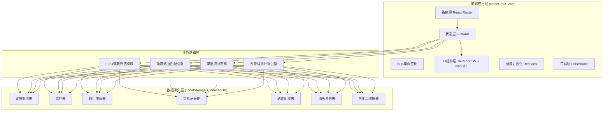
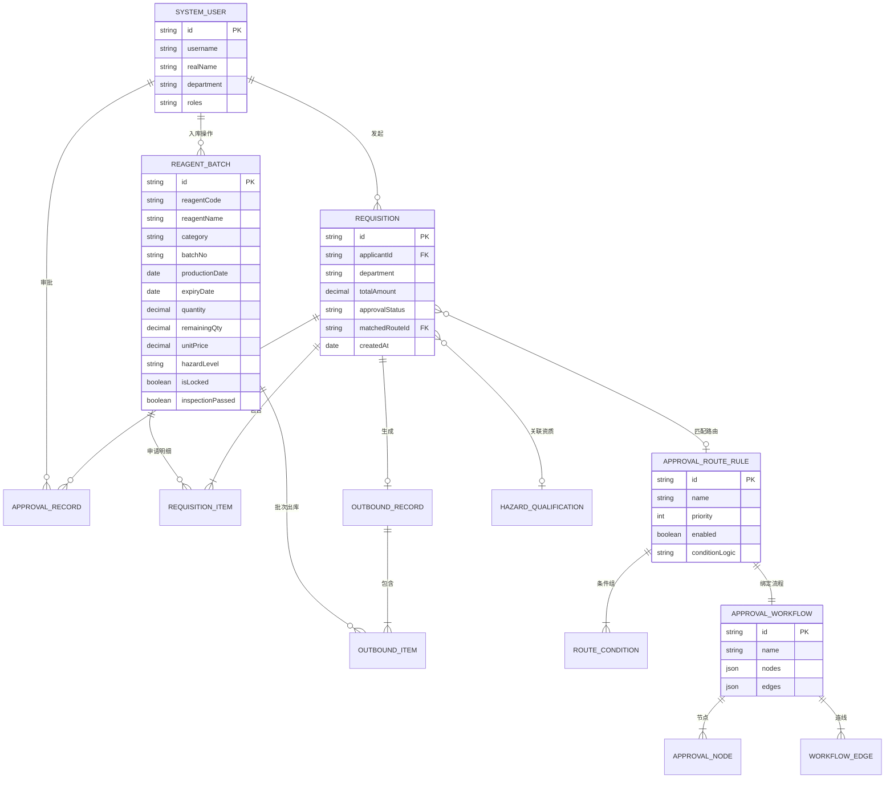

## 1. 架构设计



## 2. 技术选型说明

| 层级 | 技术栈 | 选型理由 |
|------|--------|----------|
| 前端框架 | React 18 + TypeScript 5 | 组件化开发、类型安全、生态成熟 |
| 构建工具 | Vite 5 | 开发启动快、HMR热更新、按需编译 |
| 样式方案 | TailwindCSS 3.4 + CSS变量 | 原子化CSS、快速构建UI、主题可定制 |
| 组件库 | Radix UI Primitives + 自定义封装 | 无障碍支持、Headless可定制、符合设计规范 |
| 状态管理 | Zustand 4 | 轻量、无Provider嵌套、DevTools支持 |
| 路由 | React Router v6 | 嵌套路由、动态参数、懒加载支持 |
| 图表库 | Recharts 2 | React原生、与数据绑定简洁、动画支持好 |
| 图标 | Lucide React | 线性风格、开源免费、按需加载 |
| 数据存储 | LocalStorage + IndexedDB (Dexie.js) | 纯前端演示、无需后端、数据持久化 |
| 表单处理 | React Hook Form 7 + Zod | 性能好、校验与类型推导、轻量 |
| 拖拽交互 | @dnd-kit/core + sortable | 现代拖拽库、无障碍、性能优秀 |
| 日期处理 | date-fns 3 | 不可变、函数式、按需引入体积小 |

## 3. 路由定义

| 路由路径 | 页面名称 | 说明 |
|----------|----------|------|
| `/` | 工作台仪表盘 | 系统首页，数据概览与快捷入口 |
| `/batch` | 试剂批次列表 | 批次查询、筛选、导入导出 |
| `/batch/new` | 新增批次入库 | 到货验收+效期登记表单 |
| `/batch/:id` | 批次详情 | 批次信息、效期日志、出入库历史 |
| `/inventory` | 库存管理 | 实时库存、FIFO排序、效期状态标识 |
| `/inventory/warning` | 临期预警中心 | 三级预警列表、批量处理 |
| `/inventory/expired` | 过期锁定管理 | 过期批次、销毁申请流程 |
| `/approval/config` | 审批路由配置 | 条件规则列表、优先级管理 |
| `/approval/config/:id` | 路由规则编辑 | 条件编辑器+审批节点配置 |
| `/approval/flow` | 审批流设计器 | 可视化流程画布、模拟测试 |
| `/approval/todo` | 审批工作台 | 待办/已办/我发起的审批 |
| `/requisition` | 领用申请列表 | 申请单查询、状态跟踪 |
| `/requisition/new` | 新建领用申请 | 试剂选择+FIFO预览+审批路由匹配 |
| `/requisition/:id` | 申请详情/出库 | 申请详情、审批流程、FIFO出库确认 |
| `/hazard` | 危化品管理 | 资质管理、安全台账、领用监控 |

## 4. 核心数据类型定义 (TypeScript)

```typescript
// 试剂类型
type ReagentCategory = '普通试剂' | '有机试剂' | '无机试剂' | '生化试剂' | '标准品' | '危化品';
type HazardLevel = '无' | '易燃' | '易爆' | '有毒' | '腐蚀性' | '易制毒' | '易制爆';
type WarningLevel = 'normal' | 'warning90' | 'warning30' | 'warning7' | 'expired';
type ApprovalStatus = 'draft' | 'pending' | 'approved' | 'rejected' | 'returned';
type ApprovalMode = 'or_sign' | 'and_sign';

// 试剂批次
interface ReagentBatch {
  id: string;
  reagentCode: string;        // 试剂编码
  reagentName: string;        // 试剂名称
  category: ReagentCategory;
  casNo?: string;             // CAS号
  batchNo: string;            // 批号
  manufacturer: string;       // 生产厂家
  productionDate: string;     // 生产日期 YYYY-MM-DD
  expiryDate: string;         // 有效期至 YYYY-MM-DD
  quantity: number;           // 入库数量
  unit: string;               // 单位 mg/mL/g/瓶
  unitPrice: number;          // 单价(元)
  hazardLevel: HazardLevel;
  hazardCodes?: string[];     // GHS危险代码 H225等
  storageCondition?: string;  // 储存条件
  isLocked: boolean;          // 是否锁定(过期/异常)
  lockReason?: string;
  inspectionPassed: boolean;  // QC验收是否合格
  inspectionRemark?: string;
  arrivalDate: string;        // 到货日期
  operatorId: string;         // 入库保管员
  createdAt: string;
  remainingQty: number;       // 剩余数量(冗余字段)
}

// 审批路由条件规则
interface ApprovalRouteRule {
  id: string;
  name: string;
  priority: number;           // 优先级 数字越小越先匹配
  enabled: boolean;
  conditions: RouteCondition[];
  conditionLogic: 'AND' | 'OR';
  workflow: ApprovalWorkflow;
  createdBy: string;
  updatedAt: string;
  version: number;
}

// 路由条件
interface RouteCondition {
  id: string;
  field: 'category' | 'hazardLevel' | 'totalAmount' | 'reagentCodeList';
  operator: 'eq' | 'ne' | 'gt' | 'gte' | 'lt' | 'lte' | 'in' | 'not_in';
  value: any;
}

// 审批流程定义
interface ApprovalWorkflow {
  id: string;
  name: string;
  nodes: ApprovalNode[];
  edges: WorkflowEdge[];
}

interface ApprovalNode {
  id: string;
  type: 'start' | 'approve' | 'condition' | 'end';
  label: string;
  assigneeRoles?: string[];   // 审批人角色
  assigneeUserIds?: string[]; // 指定审批人
  approvalMode: ApprovalMode; // 会签/或签
  timeoutHours?: number;      // 超时小时数
  timeoutAction?: 'auto_pass' | 'auto_reject' | 'notify_admin';
  position?: { x: number; y: number }; // 画布坐标
}

interface WorkflowEdge {
  id: string;
  source: string;
  target: string;
  conditionLabel?: string;
}

// 领用申请单
interface Requisition {
  id: string;                  // 申请单号 RL202501001
  applicantId: string;
  applicantName: string;
  department: string;
  purpose: string;             // 使用用途
  items: RequisitionItem[];
  totalAmount: number;
  matchedRouteId?: string;     // 匹配到的路由规则
  approvalStatus: ApprovalStatus;
  currentNodeId?: string;
  approvalHistory: ApprovalRecord[];
  hazardQualIds?: string[];    // 关联的资质ID
  createdAt: string;
}

interface RequisitionItem {
  id: string;
  batchId: string;             // 选定时锁定批次(FIFO推荐)
  reagentCode: string;
  reagentName: string;
  batchNo: string;
  expiryDate: string;
  quantity: number;
  unit: string;
  unitPrice: number;
  subtotal: number;
  isFifoRecommended: boolean;  // 是否FIFO推荐批次
}

// 审批记录
interface ApprovalRecord {
  id: string;
  requisitionId: string;
  nodeId: string;
  nodeLabel: string;
  approverId: string;
  approverName: string;
  action: 'approve' | 'reject' | 'return' | 'delegate' | 'auto';
  opinion?: string;
  timestamp: string;
  durationMinutes: number;     // 处理耗时
}

// 出库记录
interface OutboundRecord {
  id: string;                  // 出库单号 OB202501001
  requisitionId: string;
  operatorId: string;          // 保管员
  items: OutboundItem[];
  outboundTime: string;
  receiverSignature?: string;  // 领用人签字(电子签)
  remark?: string;
}

interface OutboundItem {
  batchId: string;
  quantity: number;
  remainingAfter: number;      // 出库后剩余
}

// 危化品资质
interface HazardQualification {
  id: string;
  type: '易制毒备案' | '易制爆备案' | '剧毒购买证' | '人员操作证' | '经营许可证';
  certificateNo: string;
  holder: string;
  issueDate: string;
  expiryDate: string;
  issuingAuthority: string;
  files?: string[];            // 附件URL
  status: 'valid' | 'expiring' | 'expired';
}

// 用户
interface SystemUser {
  id: string;
  username: string;
  realName: string;
  email?: string;
  phone?: string;
  department: string;
  roles: string[];             // admin/keeper/tester/approver/safety_officer
  avatar?: string;
  isActive: boolean;
}
```

## 5. 核心算法与业务规则

### 5.1 FIFO先进先出算法
```
函数: calculateFifoBatches(reagentCode, requiredQty)
输入: 试剂编码, 需求数量
输出: 推荐批次列表(按效期升序) + 总量校验

步骤:
1. 过滤: reagentCode匹配 + remainingQty>0 + isLocked=false + 未过期
2. 排序: expiryDate ASC → arrivalDate ASC (先按效期再按入库时间)
3. 累加: 依次累加remainingQty直到≥requiredQty
4. 返回: 选中批次数组+建议分配数量
5. 标记: 效期最近批次设置isFifoRecommended=true
```

### 5.2 临期预警级别计算
```
函数: getWarningLevel(expiryDate, today=new Date())
  remainingDays = ceil((expiryDate - today) / 86400000)
  switch
    remainingDays <= 0   → expired    (红色/锁定)
    remainingDays <= 7   → warning7   (深红)
    remainingDays <= 30  → warning30  (橙色)
    remainingDays <= 90  → warning90  (黄色)
    default              → normal     (正常)
```

### 5.3 动态路由匹配引擎
```
函数: matchApprovalRoute(requisition)
  按priority升序遍历启用的ApprovalRouteRule:
    计算rule.conditions下所有条件在requisition上的布尔值
    根据conditionLogic(AND/OR)汇总结果
    首条匹配的rule → 返回其workflow
  若无匹配 → 返回默认审批流(仅部门负责人)
```

### 5.4 审批流状态机
```
状态: draft → pending → approved → outbound_completed
              ↘ rejected (终态)
              ↘ returned → (修改后重入pending)
              
节点流转:
  当前节点是或签(or_sign): 任一人同意→进入下一节点
  当前节点是会签(and_sign): 全部同意→进入下一节点
  任一驳回→跳至rejected
  任一退回→跳至returned
```

## 6. 数据模型ER图



## 7. 目录结构规范

```
src/
├── assets/                  # 静态资源 字体/图片/GHS图标
│   ├── fonts/
│   └── icons/
├── components/              # 可复用组件
│   ├── ui/                  # 基础UI Button/Input/Modal等
│   ├── layout/              # Sidebar/Topbar/Breadcrumb
│   ├── reagent/             # 试剂相关 ReagentSelector/BatchCard
│   ├── approval/            # 审批相关 FlowCanvas/Node/RuleEditor
│   ├── inventory/           # 库存相关 FifoTable/WarningCard
│   └── charts/              # 图表封装
├── pages/                   # 页面级组件(对应路由)
│   ├── Dashboard.tsx
│   ├── batch/
│   ├── inventory/
│   ├── approval/
│   ├── requisition/
│   └── hazard/
├── store/                   # Zustand状态
│   ├── useAuthStore.ts
│   ├── useBatchStore.ts
│   ├── useInventoryStore.ts
│   ├── useApprovalStore.ts
│   └── useRequisitionStore.ts
├── hooks/                   # 自定义Hooks
│   ├── useFifo.ts
│   ├── useWarningLevel.ts
│   ├── useRouteMatcher.ts
│   └── useApprovalFlow.ts
├── utils/                   # 工具函数
│   ├── date.ts
│   ├── storage.ts
│   ├── fifo.ts
│   ├── router.ts
│   └── mock/                # 初始Mock数据
├── types/                   # 全局类型定义
│   └── index.ts             # 第4节的TS类型
├── router/                  # 路由配置
│   └── index.tsx
├── App.tsx
├── main.tsx
└── index.css                # Tailwind入口+CSS变量主题
```
